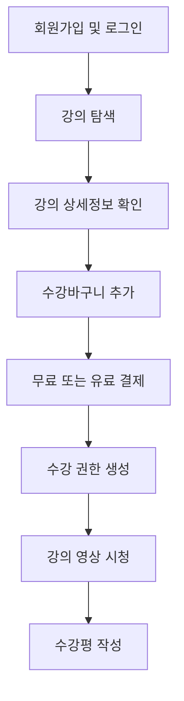
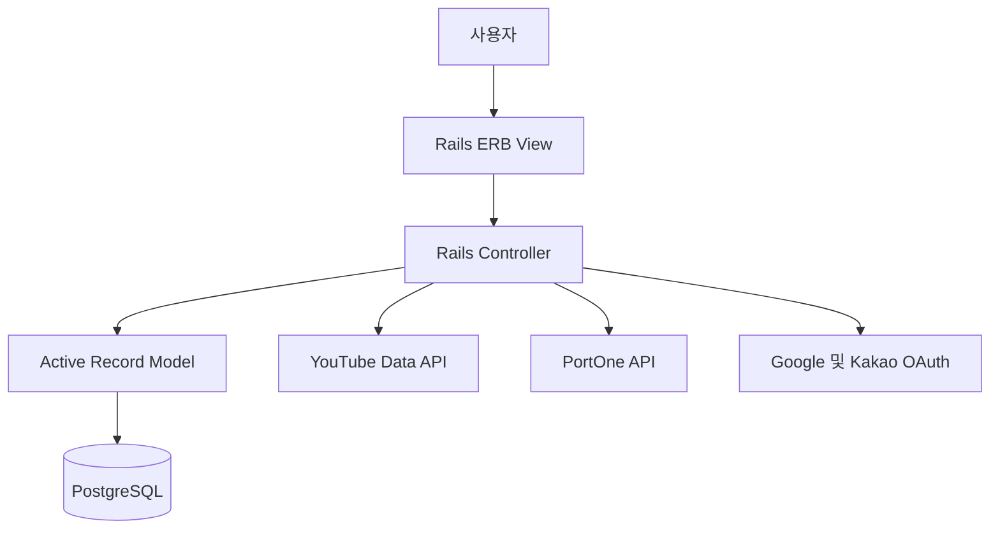
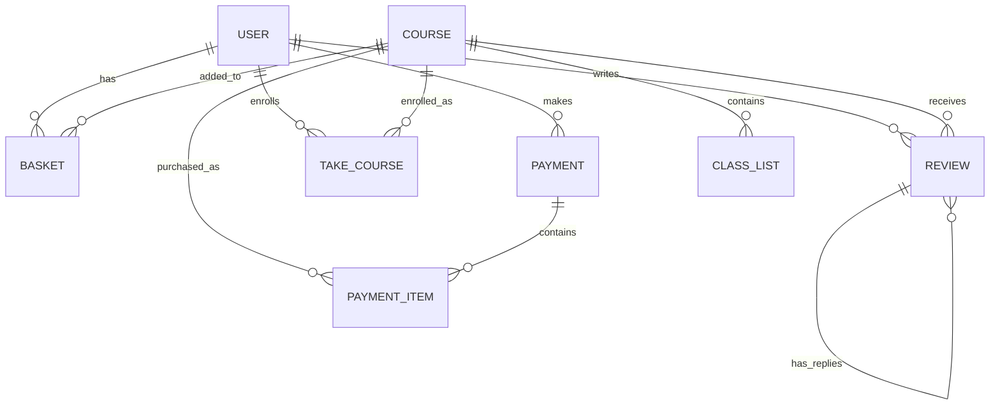

# RubyOnRails

# CATRT

> YouTube 재생목록을 온라인 강의로 가져와 수강·결제·리뷰까지 관리할 수 있는 Ruby on Rails 기반 온라인 강의 플랫폼

CATRT는 인프런과 같은 온라인 교육 서비스의 주요 사용자 흐름을 구현한 웹 애플리케이션입니다.
YouTube Data API를 통해 재생목록과 영상 정보를 자동으로 수집하고, 이를 강의와 커리큘럼으로 구성합니다.

사용자는 회원가입 후 강의를 탐색하고 수강바구니에 담을 수 있으며, 결제를 완료한 강의를 시청하고 수강평을 작성할 수 있습니다.

> 현재 프로젝트의 실제 구현 코드는 `develop` 브랜치에서 확인할 수 있습니다.

---

## 주요 기능

### 회원 및 인증

* 이메일 기반 회원가입 및 로그인
* 비밀번호 재설정
* Google 소셜 로그인
* Kakao 소셜 로그인
* 회원정보 조회 및 수정
* 마이페이지 제공

### 강의 관리

* YouTube 재생목록 URL을 이용한 강의 등록
* YouTube Data API를 통한 재생목록 정보 수집
* 재생목록에 포함된 영상 자동 등록
* 강의 제목, 설명, 제공자 및 썸네일 저장
* 영상별 제목, 설명, 재생시간 및 썸네일 저장
* 강의별 전체 커리큘럼 제공

### 강의 탐색

* 전체 강의 목록 조회
* 강의 상세정보 조회
* 강의 가격, 난이도 및 제공자 표시
* 전체 강의 수와 평균 평점 표시
* 강의별 커리큘럼 및 수강평 확인

### 수강바구니 및 결제

* 강의를 수강바구니에 추가
* 수강바구니 항목 선택 및 삭제
* 선택한 강의의 총 결제금액 계산
* 무료 강의 수강 처리
* PortOne을 활용한 유료 강의 결제 연동
* 결제 완료 후 수강 권한 자동 생성
* 사용자별 결제내역 및 상세정보 조회

### 수강 관리

* 결제한 강의를 내 학습 목록에 표시
* 수강 시작일 확인
* 수강 중인 사용자만 강의 영상에 접근
* YouTube 플레이어를 이용한 강의 영상 재생

### 수강평

* 수강생 대상 수강평 작성
* 1~5점 별점 등록
* 강의별 평균 평점 계산
* 수강평 삭제
* 수강평 좋아요 및 취소
* 수강평에 대한 답글 작성

---

## 서비스 흐름



---

## 기술 스택

### Backend

* Ruby 2.6.5
* Ruby on Rails 6.0.2
* PostgreSQL
* Puma

### Frontend

* ERB
* HTML5
* CSS3 / SCSS
* JavaScript
* jQuery
* Webpacker
* Turbolinks
* Swiper

### Authentication

* Devise
* OmniAuth
* Google OAuth 2.0
* Kakao OAuth

### External API

* YouTube Data API v3
* PortOne Payment API

### 주요 라이브러리

* `devise`
* `omniauth`
* `omniauth-google-oauth2`
* `omniauth-kakao`
* `google-api-client`
* `rest-client`
* `httparty`
* `figaro`
* `dotenv-rails`

---

## 시스템 구성



---

## 데이터 구조



### 주요 모델

| 모델            | 설명                            |
| ------------- | ----------------------------- |
| `User`        | 회원정보와 소셜 로그인 정보를 관리합니다.       |
| `Course`      | 하나의 온라인 강의를 관리합니다.            |
| `ClassList`   | 강의에 포함된 개별 YouTube 영상을 관리합니다. |
| `Basket`      | 사용자가 수강바구니에 담은 강의를 관리합니다.     |
| `Payment`     | 결제금액, 결제상태 및 거래정보를 관리합니다.     |
| `PaymentItem` | 하나의 결제에 포함된 강의를 관리합니다.        |
| `TakeCourse`  | 사용자가 실제로 수강 중인 강의를 관리합니다.     |
| `Review`      | 강의 수강평, 별점, 좋아요 및 답글을 관리합니다.  |

---

## YouTube 강의 등록 과정

1. YouTube 재생목록 URL을 입력합니다.
2. URL에서 재생목록 ID를 추출합니다.
3. YouTube Data API를 통해 재생목록 정보를 가져옵니다.
4. 재생목록을 하나의 `Course`로 저장합니다.
5. 재생목록에 포함된 영상을 조회합니다.
6. 각 영상을 `ClassList`로 저장합니다.
7. 영상 수를 계산하여 강의의 전체 차시 수를 갱신합니다.

수집하는 정보는 다음과 같습니다.

* 재생목록 제목
* 재생목록 설명
* 채널명
* 재생목록 썸네일
* 영상 제목
* 영상 설명
* YouTube 영상 ID
* 영상 재생시간
* 영상 썸네일

---

## 디렉터리 구조

```text
RubyOnRails/
├── app/
│   ├── assets/             # CSS, SCSS 및 이미지
│   ├── controllers/        # 요청 처리 및 비즈니스 흐름
│   ├── javascript/         # JavaScript 및 Webpacker 파일
│   ├── models/             # Active Record 모델
│   ├── services/           # YouTube API 연동 서비스
│   └── views/              # ERB 기반 화면
├── config/
│   ├── environments/       # 실행 환경 설정
│   ├── initializers/       # Devise 및 애플리케이션 초기 설정
│   ├── database.yml        # PostgreSQL 설정
│   └── routes.rb           # 애플리케이션 라우팅
├── db/
│   ├── migrate/            # 데이터베이스 마이그레이션
│   └── schema.rb           # 데이터베이스 스키마
├── Gemfile                 # Ruby 의존성
└── README.md
```

---

## 실행 환경

프로젝트 실행을 위해 다음 환경이 필요합니다.

* Ruby 2.6.5
* Rails 6.0.2
* PostgreSQL
* Bundler
* YouTube Data API Key
* Google OAuth Client
* Kakao REST API Key
* PortOne 가맹점 정보

---

## 설치 및 실행

### 1. 저장소 복제

```bash
git clone -b develop https://github.com/js3617/RubyOnRails.git
cd RubyOnRails
```

### 2. Ruby 패키지 설치

```bash
bundle install
```

### 3. PostgreSQL 설정

기본 개발 데이터베이스는 다음과 같이 설정되어 있습니다.

```yaml
development:
  adapter: postgresql
  database: dev_db
  username: postgres
  password: postgres
  host: localhost
```

사용하는 PostgreSQL 환경에 맞게 `config/database.yml`을 수정합니다.

### 4. 데이터베이스 생성

```bash
rails db:create
rails db:migrate
```

필요한 경우 초기 데이터를 등록합니다.

```bash
rails db:seed
```

### 5. 환경변수 설정

프로젝트 루트에 `.env` 파일을 생성합니다.

```env
YOUTUBE_API_KEY=your_youtube_api_key

GOOGLE_CLIENT_ID=your_google_client_id
GOOGLE_CLIENT_SECRET=your_google_client_secret

KAKAO_REST_API_KEY=your_kakao_rest_api_key

PORTONE_MERCHANT_CODE=your_portone_merchant_code
PORTONE_API_KEY=your_portone_api_key
PORTONE_API_SECRET=your_portone_api_secret
```

> `.env` 파일에는 API 키와 인증정보가 포함되므로 Git에 업로드하지 마세요.

### 6. 서버 실행

```bash
rails server
```

브라우저에서 다음 주소로 접속합니다.

```text
http://localhost:3000
```

---

## 주요 페이지

| 경로               | 설명       |
| ---------------- | -------- |
| `/`              | 전체 강의 목록 |
| `/courses/:id`   | 강의 상세정보  |
| `/baskets`       | 수강바구니    |
| `/payments`      | 결제내역     |
| `/take_courses`  | 내 학습     |
| `/mypage`        | 계정정보     |
| `/users/sign_in` | 로그인      |
| `/users/sign_up` | 회원가입     |

---

## 브랜치 구성

| 브랜치          | 설명              |
| ------------ | --------------- |
| `main`       | 프로젝트 초기 README  |
| `backend`    | Rails 백엔드 초기 구성 |
| `frontend`   | 프론트엔드 초기 구성     |
| `develop-ih` | 기능 개발용 브랜치      |
| `dev`        | 주요 기능 통합 과정     |
| `develop`    | 최종 기능이 통합된 브랜치  |

---

## 현재 구현 범위

본 프로젝트는 온라인 강의 플랫폼의 핵심 흐름을 구현한 프로토타입입니다.

구현된 주요 흐름은 다음과 같습니다.

* 회원가입 및 소셜 로그인
* YouTube 재생목록 기반 강의 생성
* 강의 목록 및 상세정보 조회
* 수강바구니 관리
* 무료·유료 강의 결제
* 수강 권한 생성
* 강의 영상 시청
* 수강평 및 답글 작성

다음 기능은 향후 개선이 필요합니다.

* 실제 학습 진도율 저장
* 관리자와 일반 사용자 권한 분리
* 결제 서버 검증 강화
* 리뷰 좋아요 이력의 데이터베이스 관리
* 강의 검색, 필터링 및 정렬
* 자동화된 테스트 코드
* 반응형 UI 개선
* 운영 환경 배포 설정

---

## 주의사항

본 프로젝트는 학습 및 기능 시연을 목적으로 제작된 프로토타입입니다.

실제 서비스 환경에 적용하기 전에는 다음 작업이 필요합니다.

* PortOne 서버 API를 이용한 결제 결과 재검증
* 사용자별 데이터 접근 권한 검증
* CSRF 보호 활성화
* 관리자 권한 정책 적용
* API 키와 Rails 자격증명 교체
* 예외 처리와 트랜잭션 보강
* 테스트 코드 작성
* 의존성 및 Ruby/Rails 버전 업데이트

---

## Contributors

* [js3617](https://github.com/js3617)
* [jeonginh0](https://github.com/jeonginh0)

---

## Repository

https://github.com/js3617/RubyOnRails
